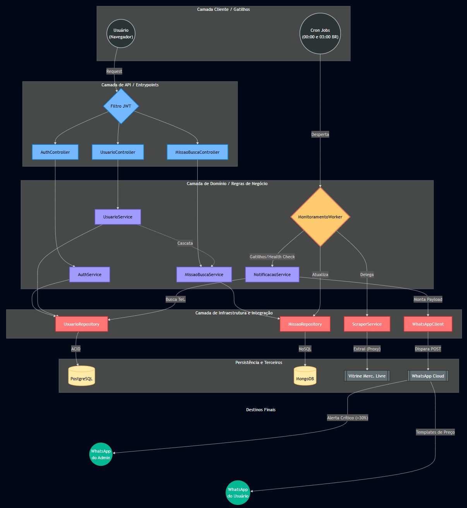

# 🛒 Monitoramento Inteligente de Preços (API)

Aplicação backend focada no rastreamento automatizado e inteligente de preços no varejo online (com foco no Mercado Livre). O sistema não depende de URLs estáticas; os usuários cadastram termos de busca precisos, e o sistema varre a vitrine da loja a cada 12 horas. Ele analisa os 5 resultados mais relevantes para criar uma média de mercado e rastrear a melhor oferta, notificando o usuário via WhatsApp apenas quando identificar descontos agressivos ou quando o preço cair abaixo do limite estipulado pelo usuário.

**Motivação Arquitetural:** A decisão de não fixar URLs garante resiliência ao sistema. Se a loja mudar a sua árvore de categorias ou a estrutura dos links internos, o monitoramento se mantém intacto, pois a aplicação simula uma pesquisa humana orgânica diretamente no motor de busca do e-commerce.

---

## 🏛️ Arquitetura do Sistema

<p align="center">
  
</p>

> 💡 **Legenda Arquitetural do Sistema:**
> - **Camada de Entrada (Cinza):** Gatilhos temporais (Cron Jobs) rodando em UTC e ações do usuário.
> - **Camada de API (Azul claro):** Entrypoints protegidos por Spring Security e filtro JWT.
> - **Camdata de Domínio (Lilás/Amarelo):** O "Cérebro" do robô (`MonitoramentoWorker`), gerindo filas de retry, regras de negócio e ownership.
> - **Camada de Infraestrutura (Vermelho):** Conectores de banco e o motor de Web Scraping via Smart Proxies (ScraperAPI + Jsoup).
> - **Base e Destinos (Amarelo/Verde):** Persistência poliglota (PostgreSQL + MongoDB Atlas) e notificações oficiais via Meta Cloud API (WhatsApp do Usuário e Alerta Crítico ao Admin).

---

## 🚀 Status do Projeto
**Fase Atual:** Domínio Core, Infraestrutura Cloud, Mensageria Oficial (Meta Cloud API) e Observabilidade finalizados.

### Funcionalidades já implementadas:

- [x] **Setup Cloud-Native e CI/CD:** Esteira no GitHub Actions gerando build automatizado e enviando a imagem otimizada para o Docker Hub.
- [x] **Domínio de Usuário (Gestão de Identidade):** Cadastro com validação estrita, higienização de dados na borda da API (Case-Insensitive e Trim automáticos) e tratamento global de exceções (RFC 7807). Atualização de e-mail e telefone com validação rigorosa de formato e unicidade. Implementação do "Botão Vermelho" de exclusão definitiva da conta.
- [x] **Segurança Criptográfica:** Hashing de senhas de altíssima segurança com Argon2id + Pepper.
- [x] **Autenticação e Autorização:** Proteção de rotas com Spring Security, validação de JSON Web Tokens (JWT) e extração de identidade segura via `JwtAuthenticationToken`.
- [x] **Domínio de Monitoramento (NoSQL):** Persistência de dados poliglota. Criação, Listagem, Edição e Exclusão (CRUD completo) de "Missões de Busca" vinculadas ao usuário de forma segura. *Inteligência Dinâmica:* A edição de termos de busca engatilha o recálculo automático da inteligência do robô, possuindo trava de segurança contra duplicidades e Validação de Propriedade (Ownership) estrita.
- [x] **Inteligência de Filtragem:** Extração e fatiamento automático de palavras-chave a partir da intenção do usuário e suporte a Blacklists (palavras proibidas) para blindar a precisão do robô. (Previne que acessórios, como "Cabo para PlayStation", contaminem a Média de Mercado do console).
- [x] **Motor de Web Scraping Anti-Bot:** Integração com Jsoup e rede de Smart Proxies (ScraperAPI). O algoritmo burla bloqueios agressivos de WAF e validações de Captcha forçando o roteamento nativo por IPs residenciais brasileiros (via flag Premium), extraindo o HTML limpo da vitrine de resultados
- [x] **Motor Autônomo (Scheduler) e Resiliência:** O "Cérebro" do sistema orquestra a raspagem a cada 12 horas exatas (09:00 e 21:00 BRT, processados nativamente em UTC para blindar a sincronia do banco NoSQL). Possui três barreiras de resiliência:
   - *Fila de Retry em Memória:* Falhas de rede da loja ou retornos HTTP 404 não quebram o fluxo; a missão sofre throttling (pausas táticas) e é retentada até 3 vezes.
   - *Alarme Crítico (Health Check):* Se a taxa de falha da rotina ultrapassar 30% (indicando possível bloqueio de IP ou teste A/B no layout da loja), o sistema dispara um alerta de emergência no WhatsApp do Admin.
   - *Coveiro de Missões Zumbis:* Job diário alinhado perfeitamente à meia-noite (03:00 UTC) desativa buscas ativas há mais de 6 meses, poupando processamento e requisições de proxy.
- [x] **Mensageria Oficial e Compliance (WhatsApp Cloud API):** Operando em ambiente de produção oficial (fora do Sandbox) com e-SIM dedicado e cadastro verificado. Disparo de templates de alerta de oportunidade e meta atingida via integração oficial com a Meta (OpenFeign), garantindo entrega de alta performance e blindagem total contra suspensões corporativas.
- [x] **Observabilidade e Monitoramento Ativo:** Implementação do Spring Boot Actuator com exposição cirúrgica apenas da rota de `/health`. O Spring Security bloqueia o acesso a métricas sensíveis (vazamento de memória/variáveis), permitindo a integração segura com ferramentas de monitoramento externo (UptimeRobot) para auditoria contínua de integridade da API, do PostgreSQL e do MongoDB.

---

## 🛠️ Stack Tecnológico
*   **Linguagem:** Java 21 (Records, Streams)
*   **Framework:** Spring Boot 3.4.x
*   **Build Tool:** Gradle
*   **Segurança:** Spring Security, JWT, BouncyCastle (Argon2id + Pepper)
*   **Bancos de Dados (DBaaS):** PostgreSQL (Supabase) e MongoDB (Atlas)
*   **Integrações:** Jsoup, OpenFeign, ScraperAPI (Proxy), WhatsApp Cloud API (Meta)
*   **Documentação:** Swagger (Springdoc OpenAPI)
*   **Monitoramento:** Spring Boot Actuator, UptimeRobot
*   **Testes:** JUnit 5, Mockito
---

## 🏛️ Destaques Arquiteturais

### 1. Monolito Poliglota (Cloud Distributed)
O sistema foi desenhado como um monolito modular que utiliza o melhor de dois mundos na persistência de dados, operando de forma 100% distribuída:
*   **PostgreSQL (Supabase):** Gerencia dados estruturados e com necessidade de integridade referencial ACID (Ex: Usuários e Credenciais).
*   **MongoDB (Atlas):** Armazenamento de alto volume e esquema dinâmico (Missões e a Série Histórica temporal de preços diários). Permite anexar variações de preços em milissegundos sem queries relacionais pesadas.

### 2. Desenvolvimento Orientado a "Vertical Slice"
Toda a produção do código segue a orientação de Vertical Slice (Fatia Vertical). Cada funcionalidade é desenvolvida de ponta a ponta na mesma branch (Infraestrutura → Domínio → API), com exigência de cobertura estrita de Testes Unitários nas camadas de Serviço e Transformação antes do merge, eliminando o acúmulo de código ocioso.

### 3. Segurança Anti-Mass Assignment e Blindagem de API
A aplicação é protegida contra ataques de Injeção de Propriedades. Nenhuma Entidade vaza pela API, sendo o tráfego isolado por DTOs instanciados via Builder. Dados sensíveis (IDs, Roles, Datas de Criação) nunca são extraídos do payload da requisição, mas sim do Token JWT resolvido em tempo de execução, mitigando escalonamento de privilégios.

### 4. Orquestração Cross-Database (Exclusão em Cascata)
Sem Foreign Keys nativas entre o SQL e o NoSQL, a exclusão de uma conta exige orquestração via software. O fluxo expurga primeiramente todos os documentos no MongoDB. Apenas em caso de sucesso, a exclusão do usuário no Postgres é comitada via `@Transactional`, eliminando o risco sistêmico de "missões órfãs".

---

## ☁️ Acesso ao Ambiente na Nuvem (Live)
O projeto está 100% operacional em nuvem, rodando em uma instância leve do Google Cloud Platform (GCP). Como o sistema opera estritamente como backend (sem uma interface gráfica frontend acoplada), toda a iteração de cadastro, autenticação e gestão de robôs deve ser feita diretamente pelos endpoints oficiais documentados.

Para testar ou utilizar a aplicação ao vivo, acesse:

🔗 Documentação e Interação (Swagger UI): http://34.170.234.74/swagger-ui/index.html#/

🩺 Monitoramento de Saúde (Actuator): http://34.170.234.74/actuator/health

## ⚙️ Como Executar a Imagem Docker (Self-Hosting / Local)
Caso deseje subir uma cópia exata desta infraestrutura em um ambiente próprio ou para desenvolvimento local, siga os passos abaixo:

1. Crie o arquivo .env na raiz do diretório:
   O sistema injeta credenciais em tempo de execução para manter a segurança do repositório. Preencha com as credenciais reais:

```
# Banco de Dados (Supabase e MongoDB)
SPRING_DATASOURCE_URL=jdbc:postgresql://[URL_DO_SEU_SUPABASE]:5432/postgres
SPRING_DATASOURCE_USERNAME=[SEU_USUARIO_SUPABASE]
SPRING_DATASOURCE_PASSWORD=[SUA_SENHA_SUPABASE]
SPRING_DATA_MONGODB_URI=mongodb+srv://[SUA_URI_DO_MONGO_ATLAS]

# Segurança (Tokens e Criptografia)
API_SECURITY_TOKEN_SECRET=[SUA_CHAVE_JWT_SECRETA]
API_SECURITY_PEPPER=[SUA_CHAVE_PEPPER_ARGON2]

# Integrações Externas
API_SCRAPERAPI_KEY=[SUA_CHAVE_DO_PROXY]
WHATSAPP_PHONE_ID=[SEU_ID_TELEFONE_META]
WHATSAPP_TOKEN=[SEU_TOKEN_META]
```
2. Baixe a Imagem Oficial e Inicie o Container:
   O comando abaixo mapeia a porta HTTP, limita a alocação de memória RAM na JVM (prevenindo OOMKilled no Linux) e inicia a aplicação em segundo plano:

```bash
docker pull magalhaesrafa/monitoramento-precos:latest

docker run -d \
--name monitoramento-api \
--restart unless-stopped \
-p 80:8085 \
--env-file .env \
-e JDK_JAVA_OPTIONS="-Xms256m -Xmx400m" \
magalhaesrafa/monitoramento-precos:latest
```

3. Acompanhe os Logs e a Saúde do Sistema:

```bash
docker logs -f monitoramento-api
```